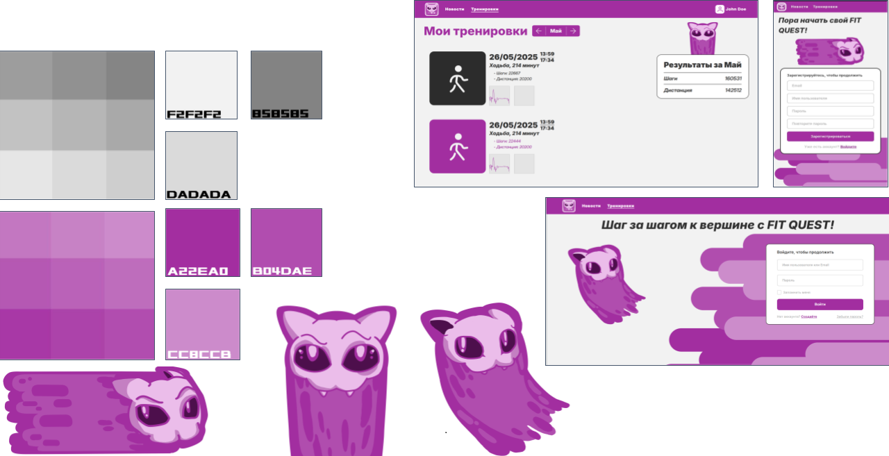

# fit-quest (был на fit-quest.ru) - проект больше не в разработке

«Fit Quest» – проект, объединяющий и связывающий спортивный новостной агрегатор и сервис мониторинга здоровья в одном продукте. Проект сделан в рамках ИШИТР+ ТПУ за ~2 месяца.

Проект состоит из сайта и небольшого андроид приложения, предназначенного для интеграции с Health Api, которое получилось из-за деприкейта google fit rest api. На сайте готовы логин, регистрация, просмотр тренировок по месяцам, вывод какой-то минимальной статистики на фронтэнде. Не успели сделать агрегатор новостей и рекомендательную систему на основе данных о тренировках.

[Скриншоты интерфейса](dock/images.md)

## Стек

- Бд на Postgresql
- Бэкэнд на Scala typelevel
- Frontend на HTML, SCSS, TypeScript, Vite
- (CI)/CD через docker и github actions (на тестах заглушка)

## В проекте участвовали

- [Егор](https://github.com/andreyegor) - [бэкэнд](#про-бэкэнд), [андроид](#про-андроид)
- [Степан](https://github.com/t0skliviy) - [дизайн](#про-дизайн)
- [Алексей](https://github.com/e1shiy) - [frontend](#про-фронтэнд)

## Про Бэкэнд

Бэкэнд написан полностью в функциональном стиле с использованием tagless final подхода. Без использования готовых решений написана система авторизации с аутентификацией на основе access/refresh токенов и http4s middleware. Может хранить и отдавать данные о тренировках по запросу.

Это были первые попытки в прикладной полностью функциональный код, пришлось написать довольно много вещей которые обычно есть из коробки, но я в целом скорее доволен качеством получившегося кода, хотя есть несколько мест где его можно значительно улучшить.

## Про дизайн

Была выбрана следующая палитра для дальнейшей работы, которая обеспечивает представления уникальности и некой волшебности нашей работы. В figma разработаны дизайны страниц сайта для Desktop и мобильных версий.

В ходе работы был разработан маскот. Вашему вниманию, Бродяга - призрак когда-то бродячего кота. При его разработке были вложены следующие идеи:

- Бродячий кот является образом активного образа жизни - он никогда не стоит на месте, передвигается с одного места на другое.
- В нашем представлении, призрак может проходить через любые поверхности. То есть, если Бродяга остановится, не будет активно двигаться, то просто провалиться сквозь Землю.

Идея данного маскота появилась во время разработки компаньона, который должен помогать в самом начале новым пользователям и следовать за ними во время их приключений!

## Про фронтэнд

Разметка написана целиком и полностью на HTML, стили на препроцессоре стилей SCSS, все скрипты на TS. Сборка совершалась через Vite, готовые решения не использовались.
Вёрстка адаптивная, написана по БЭМ-методологии. Скрипты написаны в попытке смотреть на ООП, но много чего можно и нужно доработать/переработать.

## Про андроид

Приложение для интеграции с Google Health Connect, можно залогиниться и синхронизировать вручную, автосинхронизация проходит два раза в сутки.

Минимальное приложение для своей цели, написан в спешке и с нулевыми знаниями об андроид разработке и разработке на kotlin. Итоговое качество кода сомнительно, в том числе из-за того, что использовалось какое-то количество сгенерированного кода, конечно довольно далеко до вайбкодинга (к счастью), но всё таки лучше об этом упомянуть.

---

Подвал для ИШИТР+

- [User story](/dock/user-story.md)
- [Features](/dock/features.md)
- [Criteria](/dock/criteria.md)
- [Tracking](/dock/tracking.md)
